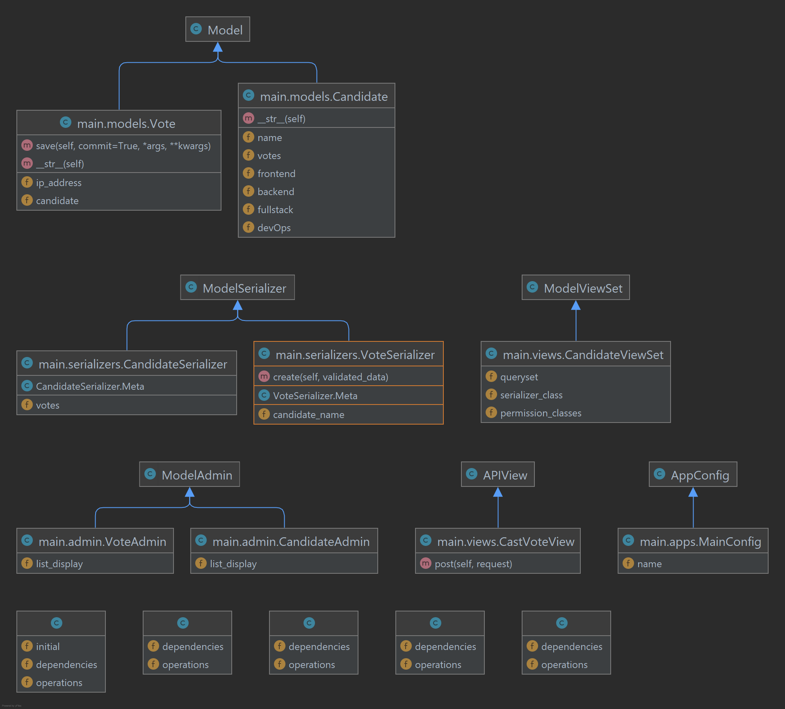
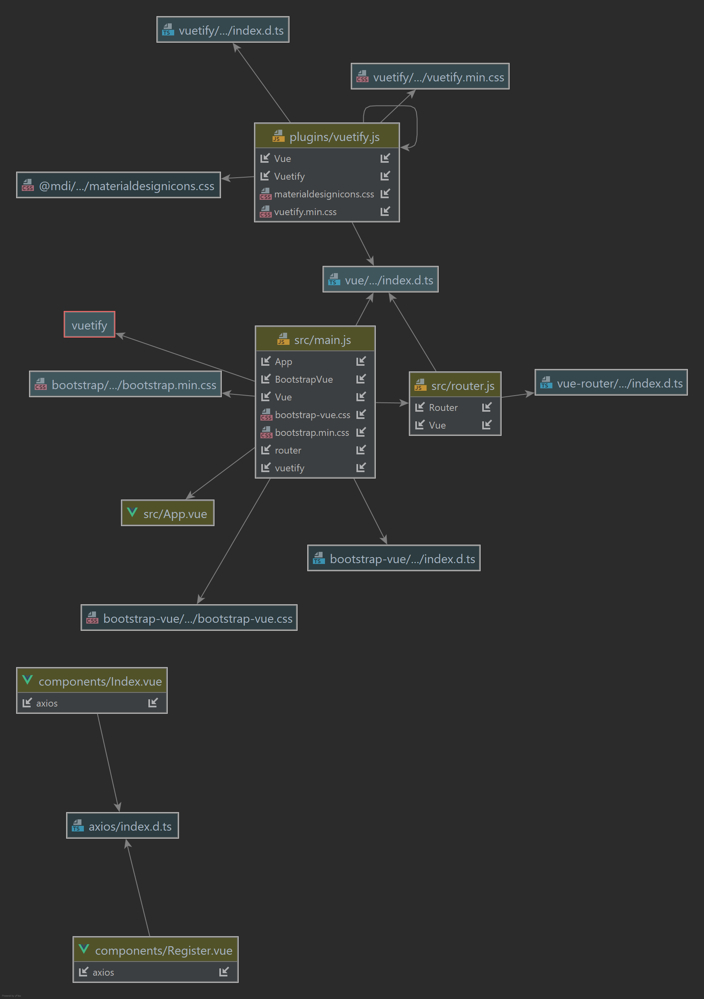
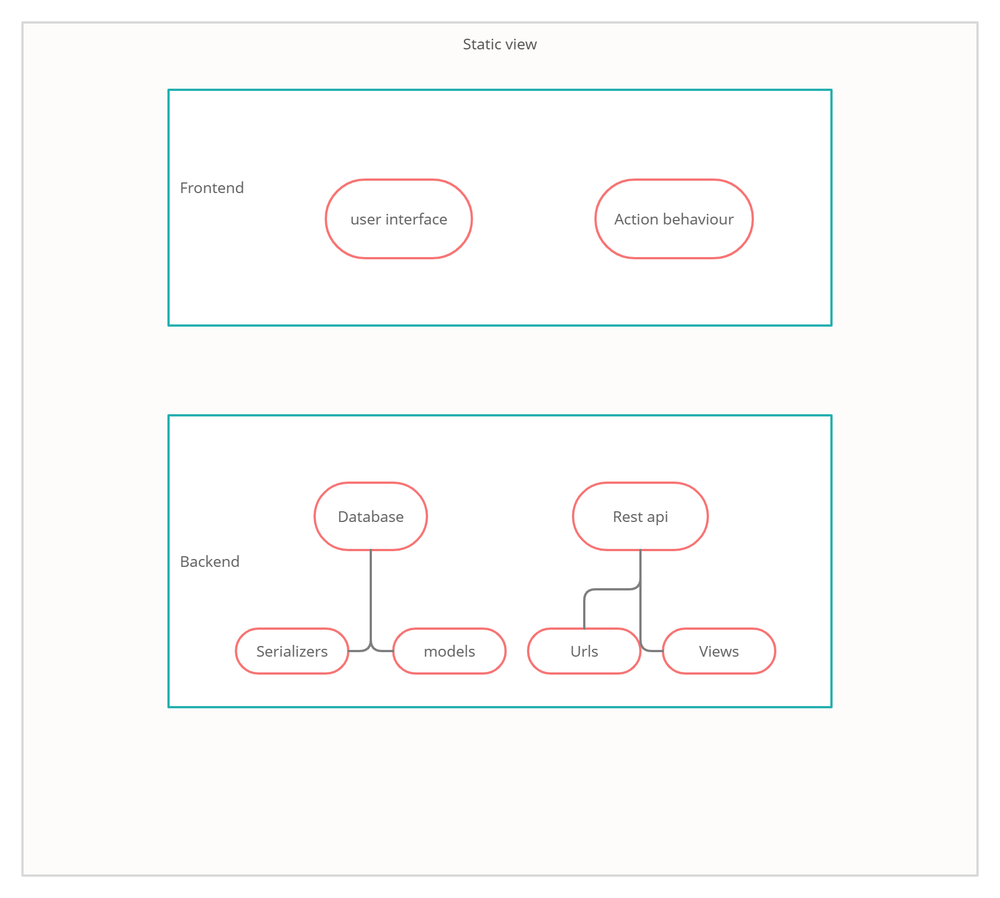
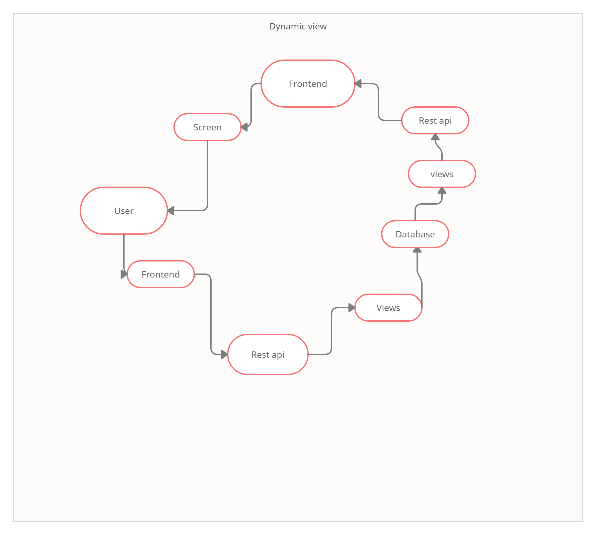

# The application details

- Admins can add candidates for voting (authenticated using basic auth)
- People can vote for a candidate
- Voting twice disabled using IP address
- CRUD REST for candidate on the endpoint: localhost:8000/api/candidate (basic auth required)
- Vote endpoint: localhost:8000/api/vote (The post request should contain the candidate_name)

# Technical details

- Backend with REST APIs using Django Rest Framework
- Frontend with Vue.js

## Get Started
- Create a virtual environment (optional)
- Install dependencies : `pip install -r requirements.txt`
- Run migration: `python manage.py migrate`
- Run the server: `python manage.py runsever`

Video presentation: https://youtu.be/MuPDqI7fJ7c

## Run the vue app
Run the following comands from `frontend/vote-app`

- Install dependencies: `yarn install`
- Run: `yarn serve`

Look in `frontend/vote-app` for more details on same

## UML diagrams

Backend UML

Frontend UML

Static view

Dynamic view

